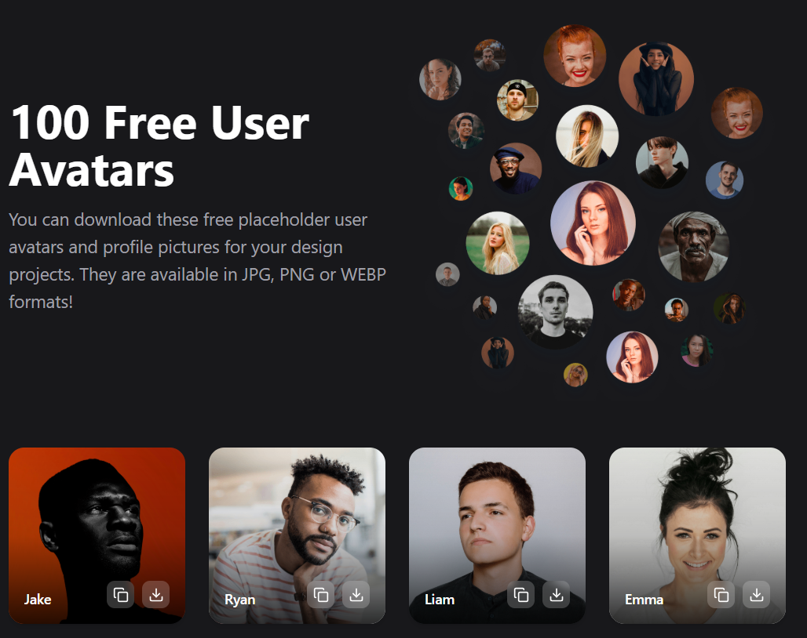

# Avatar Placeholder



A React application that displays a collection of avatar images with download and copy functionality.

Live Demo: [[avatar-placeholder.vercel.app](https://avatarplaceholder.netlify.app/)](https://avatarplaceholder.netlify.app)

## Features

- **Avatar Display**: Grid layout of avatar images from Tabler Icons
- **One-Click Copy**: Copy image URLs to clipboard with visual confirmation
- **Download Avatars**: Save images with automatically generated filenames
- **Responsive Design**: Optimized for all device sizes
- **Unique Naming**: Each avatar has a distinct identifier
- **Error Handling**: Graceful fallback for broken image links

## Installation

```bash
git clone https://github.com/abhijeetSinghRajput/avatar-placeholder.git
cd avatar-placeholder
npm install
npm start
```

## Usage

1. Browse the avatar collection
2. Click "Copy" to copy the image URL
3. Click "Download" to save the avatar
4. Features include:
   - Instant "Copied!" feedback
   - Smart filename generation
   - Automatic error handling

## Tech Stack

- **Frontend**: React.js
- **Icons**: Lucide React
- **Styling**: Tailwind CSS
- **Build**: Vite (or Create-React-App)

## Project Structure

```
avatar-placeholder/
├── public/
│   ├── screenshot-homepage.png
│   └── index.html
├── src/
│   ├── components/
│   ├── App.jsx
│   ├── main.jsx
│   └── styles/
├── package.json
└── README.md
```

## Development

To contribute:

```bash
npm run dev  # Start development server
npm run build  # Create production build
npm test  # Run tests
```

## License

MIT License - see [LICENSE](LICENSE) for details.

## Connect

- Email: [abhijeet62008@gmail.com](mailto:abhijeet62008@gmail.com)
- GitHub: [abhijeetSinghRajput](https://github.com/abhijeetSinghRajput)
- LinkedIn: [abhijeet-singh-rajput1](https://www.linkedin.com/in/abhijeet-singh-rajput1/)
- Instagram: [@abhijeet_singh_rajput1](https://www.instagram.com/abhijeet_singh_rajput1/)
